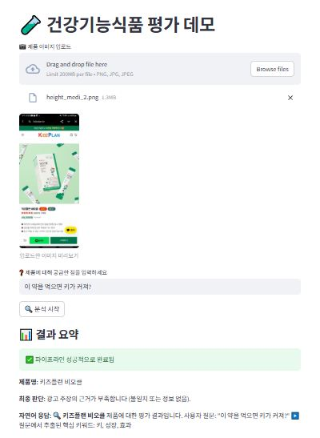
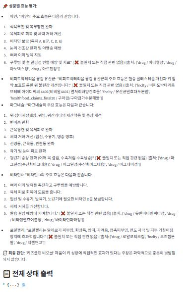

# 💊 헬스 애드 스캐너 - 건강기능식품 광고 신뢰도 검증 시스템

**식의약 공공데이터**와 실제 **광고 이미지/텍스트**를 바탕으로  
광고에서 주장하는 건강기능식품의 효능이 **사실에 부합하는지 검증**하는 AI 파이프라인 프로젝트입니다.

🧠 LLM 기반 구조로, 이미지 인식 → 웹 검색 → 성분 분석 → 공공 DB 대조 → 자연어 응답까지 자동화된 검증을 수행합니다.

---

## ⚙️ 주요 실행 파일

| 파일명 | 설명 |
|--------|------|
| `langgraph_pipeline.py` | ✅ 전체 분석 흐름을 통합한 **메인 파이프라인 실행 파일**입니다. |
| `core/` 폴더 | 각 단계를 구성하는 **모듈**들이 위치합니다. |

---

## 🧪 사용 기술
- Python 3.11.9
- LangGraph, LangChain, ChromaDB
- OpenAI GPT-4o, Gemini (Vision), Tavily Search
- Streamlit (Demo용 UI)

---

## 🚀 실행 방법

```bash
# 1. 가상환경 구성
python -m venv .venv
.venv\Scripts\activate
pip install -r requirements.txt

# 2. 환경 변수 설정 (.env 파일에 API 키 입력)
OPENAI_API_KEY=
TAVILY_API_KEY=
GOOGLE_API_KEY=
...

# 3. 데이터 임베딩 및 전체 파이프라인 실행
python core/cromadb_indexing_0.py      # 벡터 DB 생성
python langgraph_pipeline.py           # 전체 분석 파이프라인 실행

# (선택) Streamlit 데모 실행
streamlit run streamlit/streamlit_app.py
```

---

## 🧩 주요 모듈 설명 (core/)

| 모듈 | 설명 |
|------|------|
| `cromadb_indexing_0.py` | 공공 데이터를 Chroma 벡터스토어에 저장 (임베딩 수행) |
| `text_extract_1.py` | 광고 이미지에서 텍스트 추출 → 제품명/효능 추출 (LLM 사용) |
| `intent_refiner_agent_2.py` | 모호한 사용자 질문 정리 및 증강 |
| `web_search_3.py` | 제품명을 바탕으로 웹 검색 및 성분/효능 정보 증강 |
| `claim_check_4.py` | 추출된 성분과 질문을 대조 → 주장 신뢰도 판단 |
| `rag_service_4_1.py` | RAG |
| `answer_user_5.py` | 결과를 자연어 응답으로 포맷팅 |
| `prompt.py` | 위 모든 과정에서 사용하는 LLM 프롬프트 저장소 |
| `config.py` | llm, vectorDB cofing |

---

## 🔄 전체 분석 흐름

```
이미지 업로드
   ↓
텍스트 인식 (제품명 + 효능 주장 추출)
   ↓
웹 검색 통한 성분 정보 수집
   ↓
공공데이터 기반 성분-질문 대조
   ↓
최종 신뢰도 평가 및 자연어 설명 출력
```

> 이 전체 과정을 `langgraph_pipeline.py` 한 번의 실행으로 자동 수행합니다.

---

## 🗂️ 주요 디렉토리 구조

```
csv_data/
    ├── fnclty_materials_complete.csv
    ├── drug_raw.csv
    └── healthfood_claims_final10.csv

img/                        ← 입력 이미지
IMG2TEXT_data/             ← OCR 및 추출된 제품명/효능
TEXT2SEARCH_data/          ← 웹 검색 기반 정보
DECISION_data/             ← 최종 판단 결과
chroma_db/                 ← 벡터스토어 저장소
streamlit/                 ← 데모용 웹 UI
STEP_OUTPUTS/              ← langgraph_pipeline, streamlit 동작시 데이터 수집
```

---

## 📊 데모 화면

아래 이미지는 실제 데모 화면을 보여줍니다. 사용자가 업로드한 건강기능식품 광고 이미지를 분석하여 제품의 성분과 효능을 검증하는 과정을 시각적으로 확인할 수 있습니다.

1. csv 검색 성공


2. rag 검색 성공


3. 효능 없음





---

## 👥 팀 정보 및 문의

| 이름 | GitHub |
|------|--------|
| 최영환 | [@cyh5757](https://github.com/cyh5757) |
| 김경서 | [@kkyungseo](https://github.com/kkyungseo) |
| 김솔 | [@kimsol1134](https://github.com/kimsol1134) |

📮 기여 및 문의는 자유롭게 [Issues](https://github.com/medicalBiobyte/demo-repository/issues) 등록해 주세요!

